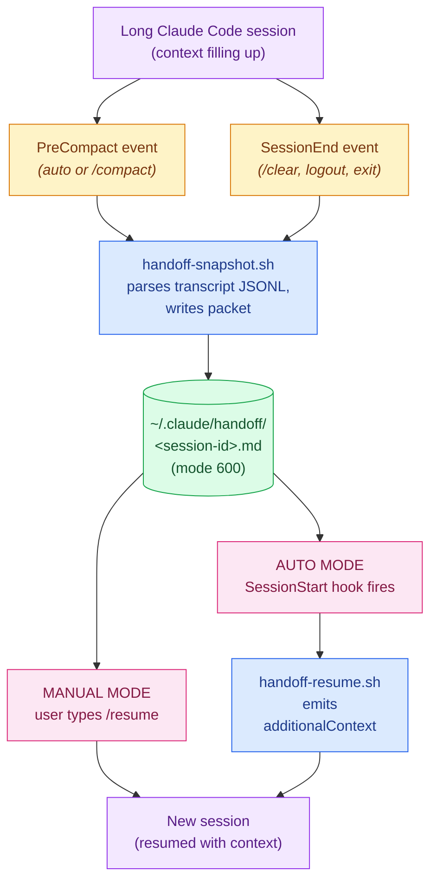

# claude-state

[](https://github.com/bansalbhunesh/claude-code-handoff/actions/workflows/ci.yml)
[](LICENSE)
[](https://github.com/bansalbhunesh/claude-code-handoff/releases)
[](tests/)
[](https://github.com/bansalbhunesh/homebrew-claude-state)
[](docs/plugin-contract.md)

> **Persistent state for Claude Code: snapshot every session before compaction, group packets by project, surface only the signal, and expose your auto-memory through a typed plugin contract.**

```bash
brew tap bansalbhunesh/claude-state
brew install claude-state
bash $(brew --prefix claude-state)/share/claude-state/install.sh   # wires Claude Code hooks
```

Then in any Claude Code session: `/resume`.

<details>
<summary>No Homebrew? Install from source.</summary>

```bash
git clone https://github.com/bansalbhunesh/claude-code-handoff.git
cd claude-code-handoff
bash install.sh             # add --auto for SessionStart auto-resume
```

</details>

> **Renamed in v0.4.0** (was `claude-code-handoff`). The `claude-handoff` deprecation shim keeps forwarding through one minor cycle. See [MIGRATION.md](MIGRATION.md) and [PLAN.md](PLAN.md).

---

## Before vs after

| Without this plugin | With this plugin |
|---|---|
| Long session → compaction → summary survives, **details die** | PreCompact hook writes a `handoff/<session>.md` snapshot first |
| New session: "I have no idea what we were doing" | New session: `/resume` (or auto) → "Resuming X. Done A, B. Last decision: Y." |
| `/clear` = total amnesia | SessionEnd hook captures even `/clear` exits |
| Lost context = re-explore + re-explain | Pick up where you left off, ~5 seconds |

No daemon. No code change in your repo. ~2500 lines of bash + jq, one install, one uninstall, plus a [typed plugin contract (`v=1`)](docs/plugin-contract.md) that other tools can build against. Plays nice with any other hooks you already have.

---

## Quick start

Install via Homebrew (the install line in the hero above), then in any Claude Code session run:

```
/resume
```

Want it fully automatic (no typing `/resume`)?

```bash
bash $(brew --prefix claude-state)/share/claude-state/install.sh --auto
```

(Or, if you installed from source, `bash install.sh --auto` from the cloned repo.)

A `SessionStart` hook will inject the packet on every post-compaction or resumed session. Opt-in because some of the underlying mechanism is undocumented — see [Limitations](#limitations).

---

## What a packet looks like

A real packet from a real session — markdown, human-readable, ~1–2 KB:

```markdown
# Handoff packet
- session: 300b907c-d452-4064-ac2c-ee2b9c98213f
- event: PreCompact
- generated: 2026-04-26T23:16:48Z
- cwd: /Users/ankur
- continues_from: 7c2db8e1-...   # only set if this is a chained session

## Original goal
build a /handoff slash command + PreCompact hook

## Current todos
(no TodoWrite calls in this session)

## Task tracker
#1. [completed] Write handoff-snapshot.sh
#2. [completed] Wire PreCompact hook
#3. [in_progress] Test the round-trip

## Recently edited files
- Write: ~/.claude/claude-state/modules/handoff/snapshot.sh
- Edit:  ~/.claude/settings.json
- Write: ~/.claude/commands/resume.md

## Recent assistant reasoning
The keystone is `PreCompact` → `SessionStart(source=compact)`. Snapshot at
PreCompact, re-inject at SessionStart. Verified with /compact in another
terminal — the hook fires and the packet lands.

---

Next: confirm /resume can read it from a fresh session before adding the
auto-resume `SessionStart` hook.
```

That's the whole format. Pure markdown. You can `cat`, `grep`, `vim`, or feed it to anything.

---

## Two ways to resume

| | **Manual** (default) | **Auto-resume** (`--auto`) |
|---|---|---|
| **How** | Type `/resume` in a new session | New session auto-loads packet |
| **Triggered by** | You | `SessionStart` hook (`compact` / `resume` matchers) |
| **Permission prompt on first use** | Pre-approved by `allowed-tools` frontmatter — none | None |
| **Stability** | Documented and stable | Relies on `SessionStart`'s `additionalContext` injection (works today, undocumented size limits) |
| **Best for** | First-time users, low-trust environments | Power users who've confirmed manual mode works |

Switching modes is one command, both directions:

```bash
./install.sh --auto    # turn on auto-resume
./install.sh           # turn off auto-resume (re-running without --auto strips it)
```

Third-party `SessionStart` hooks (from other plugins) are preserved across toggles.

---

## Daily use — `claude-state` CLI

`bin/claude-state` is installed to `~/.claude/bin/`. Add that to your `$PATH`, or invoke by full path. (`bin/claude-state` is also installed as a deprecation shim that forwards to `claude-state` and prints a one-line warning; it's removed in v0.6.)

```text
$ claude-state list
300b907c-d452-4064-ac2c-ee2b9c98213f        1h 30m ago

1 packet(s). Use 'claude-state view <session-id>' to read one.
```

```text
$ claude-state status
claude-state status
  version (cli):      0.2.0
  jq:                 1.6
  handoff dir:        present (mode 700)
  snapshot script:    installed
  resume script:      installed
  /resume command:    installed
  PreCompact hook:    wired
  SessionEnd hook:    wired
  SessionStart hook:  not wired (manual mode)
  mode:               manual
  packets stored:     1
```

| Subcommand | What it does |
|---|---|
| `claude-state list` | All packets, newest first, with relative ages |
| `claude-state view` | Show the most recent packet |
| `claude-state view <session-id>` | Show a specific packet |
| `claude-state search <pattern>` | Case-insensitive grep across all packets, with surrounding context |
| `claude-state chain [<session-id>]` | Walk `continues_from` links and print the full chain (default: latest) |
| `claude-state edit <session-id>` | Open a packet in `$EDITOR` to redact secrets without losing the rest |
| `claude-state status` | Install state, mode, jq version, packet count |
| `claude-state path` | Print the handoff directory path |
| `claude-state signal <packet> [--explain] [--threshold N] [--raw]` | Re-score a packet's reasoning section |
| `claude-state memory list/get/add/archive/supersede/query/rebuild-index` | Typed CLI for the markdown memory store; `query --json` is the v=1 plugin contract |
| `claude-state prune --older-than 30d` | Delete packets older than 30 days (interactive) |
| `claude-state prune --keep 20` | Keep 20 most recent, delete the rest (interactive) |
| `claude-state help` | Show usage |

**Environment knobs** for the snapshot script (set in your shell or hook env):

| Variable | Effect |
|---|---|
| `CLAUDE_HOME` | Override `~/.claude` (must match what `install.sh` was given) |
| `HANDOFF_KEEP_N=20` | After each snapshot, keep only the 20 newest packets — built-in retention without cron |
| `HANDOFF_DEBUG=1` | Append a one-line status to `~/.claude/handoff/.log` per hook fire (for troubleshooting silent hooks) |

`prune` is **always interactive** — it lists what it will delete and asks before removing anything.

---

## Workspaces (v0.4)

A **workspace** groups sessions by project, so `/resume` and `claude-state resume` pick the right packet when you switch repos. Identity is `<sanitized-basename>-<8-char-sha256>`, derived from `git rev-parse --show-toplevel` (or cwd if you're not in a repo). The 8-char hash prevents collisions between two clones of the same repo at different paths, or between unrelated dirs that share a basename.

Snapshots in v0.4 write `workspace:` and `workspace_root:` frontmatter on each packet. Older v0.3 packets are **backfilled** at index-rebuild time from their `cwd:` field, so you don't have to re-run anything to see your history grouped.

```bash
$ claude-state workspaces
WORKSPACE                                          PACKETS  LAST SEEN
claude-code-handoff-fd3ef08c                             7  2026-04-27T08:24:50Z
  → /Users/ankur/Work/claude-code-handoff
ankur-26d9bb19                                           2  2026-04-27T01:41:06Z
  → /Users/ankur

$ claude-state workspaces show claude-code-handoff-fd3ef08c
Workspace: claude-code-handoff-fd3ef08c
  root:  /Users/ankur/Work/claude-code-handoff
  alias: (none)
  first: 2026-04-27T07:42:01Z
  last:  2026-04-27T08:24:50Z
  count: 7
Packets:
  11ba59d8-d49f-4fb6-ad0e-34f779c62d95   17m ago
  ea5f8eed-4c06-4485-81fb-4b8fd5efcc4c   7h 12m ago
  ...
```

| Subcommand | Effect |
|---|---|
| `claude-state workspaces` (or `ws`) | List all workspaces, newest activity first |
| `claude-state workspaces show <ws>` | Show one workspace's metadata + packet list |
| `claude-state workspaces rebuild` | Regenerate `~/.claude/handoff/index.json` from packet frontmatter (preserves aliases) |
| `claude-state workspaces rename <ws> <alias>` | Set a human-friendly alias (survives rebuilds) |

### Smart `claude-state resume`

The new `resume` subcommand is workspace-aware:

(continued — Smart resume table follows below; before that, here's signal scoring from v0.5.)

---

## Signal scoring (v0.5)

Snapshots run assistant reasoning blocks through a relevance scorer at write time. High-signal content (decisions, blockers, file references, goal restates) stays in the main `## Recent assistant reasoning` section; low-signal content (filler acks, very short progress notes) drops into a collapsed `<details>` block at packet bottom — **lossless by default**, just out of the way.

```
## Recent assistant reasoning
blocked: tests fail because the snapshot script can't find lib/common.sh in modules/

---

Plan: scaffold modules/signal/, then write tests in tests/test_signal.sh. Goal: ship v0.5.

<details>
<summary>2 low-signal block(s) dropped (signal threshold 3)</summary>

**[score -8, ack_only+too_short_no_signal]**

ok thanks

---

**[score 2, decision]**

I went with rebase merge as the conclusion. The repo prefers linear history.

</details>
```

Tune the threshold against your own corpus without re-snapshotting:

```bash
$ claude-state signal <session-id> --explain --threshold 0
threshold=0   kept=5   dropped=0   total=5
[+] 0    score=-8    ack_only+too_short  ok thanks
[+] 1    score=2     decision            I went with rebase merge ...
[+] 2    score=4     blocker+file_ref    blocked: tests fail because ...
[+] 3    score=4     first_goal          Plan: scaffold modules/signal/ ...
[+] 4    score=-3    last_2              wrapping up the work
```

| Subcommand / flag | Effect |
|---|---|
| `claude-state signal <packet>` | Re-render kept body + `<details>` block (default threshold 3). |
| `claude-state signal <packet> --explain` | Per-block table: `[+]` kept / `[-]` dropped, score, reason, first 60 chars. |
| `claude-state signal <packet> --threshold N` | Override threshold for this invocation. `N=0` is the escape hatch (keep everything). |
| `claude-state signal <packet> --raw` | Emit the unfiltered block list (for piping). |
| `HANDOFF_SIGNAL_MIN=N` env | Default threshold for snapshot-time filtering (default `3`). |
| `HANDOFF_SIGNAL_DETAILS=0` env | Suppress the lossless `<details>` block (kept-only output). |

**Mandatory keeps** (override threshold, including `--threshold 0`): the first message containing goal-restate keywords; the last 2 messages (recency safety net).

**Heuristic, not LLM-based.** Hooks must stay sync, fast, no network. A future `claude-state signal --rescore --llm` could be a separate, opt-in offline step (out of scope for v0.5).

---

## Structured memory (v0.6)

The harness already loads `~/.claude/projects/<sanitized-cwd>/memory/MEMORY.md` into every conversation. v0.6 adds a typed CLI layered ON TOP of that store — new frontmatter fields (`state`, `created`, `created_session`, `superseded_by`) are additive and optional, the harness keeps reading what it always read, and a versioned JSON plugin contract lets other tools query memories without parsing markdown.

```
$ claude-state memory list
NAME                           TYPE       STATE      DESCRIPTION
commit_coauthor                feedback   active     For commits made on this user's behalf, use 'Co-Authored-By: bhunesh bansal'

$ claude-state memory query --json | jq '.memories[0]'
{
  "name": "commit_coauthor",
  "type": "feedback",
  "description": "For commits made on this user's behalf, use 'Co-Authored-By: bhunesh bansal'",
  "state": "active",
  "created": null,
  "created_session": "ea5f8eed-4c06-4485-81fb-4b8fd5efcc4c",
  "superseded_by": null,
  "path": "/Users/ankur/.claude/projects/-Users-ankur/memory/commit_coauthor.md"
}
```

| Subcommand | Effect |
|---|---|
| `claude-state memory list [--type T] [--state S] [--json]` | Table or JSON output of memories |
| `claude-state memory get <name> [--json]` | Read one memory (markdown or contract JSON) |
| `claude-state memory add --name N --type T --description D` | Create a memory; content via `--content -` (stdin), `--content "text"`, or `$EDITOR` |
| `claude-state memory archive <name>` | Flip `state` to `archived`; drops from active `MEMORY.md` |
| `claude-state memory supersede <old> --by <new>` | Flip `<old>` to `superseded`, write `superseded_by: <new>` |
| `claude-state memory query [--type T] [--state S] [--keyword K] [--json]` | Plugin contract entry point (`version: 1`) |
| `claude-state memory rebuild-index` | Regenerate `MEMORY.md` from active memories |

### Memory plugin contract

`claude-state memory query --json` emits a stable, versioned JSON document. Plugins should read this instead of parsing markdown:

```json
{
  "version": 1,
  "memories": [
    {
      "name":            "<filename-without-.md>",
      "type":            "feedback | user | project | reference | <custom>",
      "description":     "<one-line>",
      "state":           "active | archived | superseded",
      "created":         "<iso8601 or null>",
      "created_session": "<handoff session id or null>",
      "superseded_by":   "<other-name or null>",
      "path":            "<absolute path>"
    }
  ]
}
```

Field additions are non-breaking. Field removals or shape changes require a major bump (`version: 2`). Old `version: 1` consumers must keep working through v1.x. The legacy frontmatter field `originSessionId` is read for back-compat and surfaced under the canonical `created_session` key.

### Frontmatter additions

```yaml
---
name: commit_coauthor                          # required (filename)
description: <one-line>                        # optional
type: feedback                                 # optional
state: active                                  # optional, default 'active'
created: 2026-04-27T07:00:00Z                  # optional
created_session: ea5f8eed-4c06-...             # optional (legacy: originSessionId)
superseded_by: <other-memory-name>             # set by `memory supersede`
---
```

Existing memory files keep working unchanged. Missing fields default sensibly (`state: active`, others empty).

---

### Original smart resume table (v0.4)

| Invocation | Picks |
|---|---|
| `claude-state resume` | Newest packet whose workspace matches `$PWD`'s. Falls back to global newest if no match. |
| `claude-state resume --here` | Same, but **errors out** if `$PWD` is not in a known workspace. |
| `claude-state resume --keywords "auth bug"` | Highest-scoring packet by distinct keyword hits, recency tiebreak. |
| `claude-state resume <session-id>` | Specific packet (like `view <id>` but with a banner). |
| `claude-state resume <free text>` | Auto-detected: id if known, otherwise `--keywords`. |

The `/resume` slash command was updated to call `claude-state resume` (with a degraded `ls -t` fallback if the CLI is absent), so the model uses the same priority chain you do.

---

## How it works

The plugin sits between Claude Code's lifecycle events and the filesystem. Two scripts, one packet directory, five hook entries:



Time-ordered version of the same story:

```mermaid
sequenceDiagram
    actor U as You
    participant S1 as Old session
    participant H as PreCompact hook
    participant FS as handoff/&lt;sid&gt;.md
    participant S2 as New session

    Note over S1: working on a long task
    S1->>S1: context fills up<br/>(or you type /compact)
    S1->>H: fires PreCompact event
    H->>FS: write structured packet
    Note over S1: Claude Code compacts<br/>(wipes message history)

    U->>S2: open new session

    rect rgba(252, 231, 243, 0.4)
    Note over U,S2: Manual mode (default)
    U->>S2: types /resume
    S2->>FS: reads latest packet
    S2-->>U: "Resuming work on X.<br/>Done: A, B. Last decision: ..."
    end

    rect rgba(220, 252, 231, 0.4)
    Note over U,S2: Auto mode (--auto)
    Note over S2: SessionStart hook<br/>(matcher: compact / resume)
    FS-->>S2: hook injects packet<br/>via additionalContext
    S2-->>U: replies already aware of prior context
    end
```

The five hook entries the installer wires up:

| Event | Matcher | Mode | Script | Fires when |
|---|---|---|---|---|
| `PreCompact` | `auto` | always | `handoff-snapshot.sh` | Just before context-limit-driven auto-compaction |
| `PreCompact` | `manual` | always | `handoff-snapshot.sh` | When you type `/compact` |
| `SessionEnd` | (any) | always | `handoff-snapshot.sh` | When a session terminates (`clear`, `logout`, `prompt_input_exit`) |
| `SessionStart` | `compact` | `--auto` only | `handoff-resume.sh` | When a fresh session begins after compaction |
| `SessionStart` | `resume` | `--auto` only | `handoff-resume.sh` | When a session is resumed (`claude --resume`) |

`handoff-snapshot.sh` reads the session transcript JSONL, parses out goal / todos / task tracker / edited files / recent reasoning, and writes a markdown packet. **Always exits 0** — never blocks the underlying event.

`handoff-resume.sh` finds the most relevant packet (matching `session_id` first, then most recently modified), caps it at 16,000 codepoints (UTF-8-safe), and emits the documented `hookSpecificOutput.additionalContext` JSON shape Claude Code uses to inject context.

---

## Platforms

| Platform | Status | Notes |
|---|---|---|
| **macOS** | Fully supported, **CI tested** on `macos-latest` | — |
| **Linux** | Fully supported, **CI tested** on `ubuntu-latest` | — |
| **Windows / Git Bash** | Fully supported, **CI tested** on `windows-latest` | Same shell Claude Code uses on Windows natively (since 2025). NTFS doesn't enforce POSIX file modes, so `chmod 600` / `chmod 700` calls succeed but the bits are advisory; access control comes from Windows ACLs which inherit from your user dir (still owner-private in practice). Mode-bits *tests* skip on Windows for this reason; behavior tests run there. |
| **Windows / WSL** | Works like Linux | Recommended over Git Bash if you want hard-enforced POSIX permissions on a Linux filesystem. |
| **Windows / native PowerShell** | Not supported | Scripts are bash. A PowerShell port is on the roadmap if there's demand — [open an issue](.github/ISSUE_TEMPLATE/feature_request.yml). |

The CI matrix runs all three of `ubuntu-latest`, `macos-latest`, and `windows-latest` on every push and PR. The shellcheck + bash-syntax + json-validation + test-suite pipeline is identical across all three.

---

## Requirements

- **Claude Code** (CLI) — any recent version with hooks support
- **`bash`** 3.2 or newer (macOS default works; Git Bash on Windows works)
- **`jq`** ≥ 1.6 (we use the `//=` operator)

| OS | Install jq |
|---|---|
| macOS | `brew install jq` |
| Debian / Ubuntu | `sudo apt-get install jq` |
| Fedora / RHEL | `sudo dnf install jq` |
| Windows (Git Bash) | scoop / choco / static binary |
| Windows (WSL) | use the Linux command for your distro |
| anywhere | static binary at <https://jqlang.github.io/jq/download/> |

The plugin makes no network calls. No dependencies beyond bash + jq + standard POSIX tools (`find`, `stat`, `mv`, `mktemp`, `date`).

---

## Security

Handoff packets capture **verbatim user prompts and assistant prose** — including anything you pasted into the conversation (API keys, `.env` content, passwords, tokens) and anything the assistant repeated back in its replies. Packets sit on disk under `~/.claude/handoff/` until you delete them.

**What the plugin does:**

- **Mode 700** on `~/.claude/handoff/` (owner-only access on Unix-y filesystems)
- **Mode 600** on every newly-written packet
- **Refuses to write** through a symlinked handoff directory or symlinked output path
- **Validates `session_id`** with a regex before using it as a filename, blocking path-traversal
- **Hooks always exit 0** — they never block compaction or session shutdown, but they also never break your terminal

**What you should do:**

- **Don't paste secrets into the conversation** if you're not comfortable with them ending up in `~/.claude/handoff/`. If you do, run `./uninstall.sh --purge` (or `claude-state prune --keep 0`) to delete saved packets.
- Treat `~/.claude/handoff/` as sensitive — back it up only to encrypted destinations, never commit it.
- The plugin does **no automatic rotation** — packets accumulate indefinitely. Sweep periodically: `claude-state prune --older-than 30d` or `find ~/.claude/handoff -mtime +30 -delete`.
- **On Windows / Git Bash specifically:** NTFS doesn't enforce POSIX modes. The `chmod` calls succeed but the actual access control comes from Windows ACLs (which inherit from your user dir, so packets are still owner-private in practice). If you want hard-enforced POSIX permissions on Windows, run inside WSL2.

---

## FAQ

**Does it slow down Claude Code?**
No. The hook is a single bash invocation that reads the transcript and writes one file — typically <100ms even for hour-long sessions. Always exits 0, so even if it crashes it doesn't block the event.

**Does it touch my code or send anything over the network?**
No code changes. No network calls. The packet is local-only, owner-readable.

**Will my packets pile up forever?**
Yes, until you prune. Run `claude-state prune --older-than 30d` periodically or set up a cron. There's a roadmap item to make rotation built-in.

**What if I have other tools that hook PreCompact / SessionEnd / SessionStart?**
They keep working. The installer does a `jq` merge, not a clobber. Third-party hooks on the same matcher are preserved alongside ours; uninstall strips only entries pointing at our scripts.

**Why is `Current todos` always empty?**
Modern Claude Code uses `TaskCreate` / `TaskUpdate` instead of `TodoWrite`. The plugin captures both — the actually-useful section is `Task tracker`. The `TodoWrite` field stays for back-compat.

**What's the difference between `/resume` and auto-resume?**
Both load the same packet. `/resume` is a slash command you type; auto-resume is a `SessionStart` hook that injects automatically. Auto-resume relies on undocumented behavior (size limits, presentation to the model), so it's opt-in. Manual is recommended until you've confirmed it works for your setup.

**Can I run this on a shared machine?**
Yes, but each user gets their own `~/.claude/handoff/`. If you share `$HOME` (rare), the mode-700 directory stops other users from reading packets, but anyone with the same UID could. On Windows / NTFS, the same isolation comes from your user dir's ACL, not from POSIX modes.

**Does it run on Windows?**
Yes — on Git Bash (which is what Claude Code itself uses on Windows since 2025) and on WSL. Native PowerShell isn't supported because the scripts are bash. CI runs the full test suite on `windows-latest` every push; mode-bits tests skip there since NTFS doesn't enforce POSIX modes.

**What about Codex / Cursor / other AI coding tools?**
Right now this is Claude-Code-specific because it depends on Claude Code's hook events (`PreCompact`, `SessionEnd`, `SessionStart`). If similar tools expose comparable hooks, a port would be small. PRs welcome.

---

## Troubleshooting

### `/compact` runs but no packet appears

Run `claude-state status`. If `PreCompact hook` shows `NOT WIRED`, the install merge didn't take — re-run `./install.sh`.

If it shows `wired` but a packet still doesn't appear:
- Scripts always exit 0 (so nothing logs on failure). Temporarily add `set -x` near the top of `~/.claude/claude-state/modules/handoff/snapshot.sh` to see what's failing.
- Check `jq` is on your `PATH` — the hook runner inherits a minimal env on some platforms.

### `/resume` doesn't appear in the slash menu

Claude Code auto-discovers `~/.claude/commands/`. No restart needed. Check the file exists:

```bash
ls -la ~/.claude/commands/resume.md
```

If it does and `/resume` still isn't recognized, confirm the frontmatter is intact (the file must start with `---`).

### `/resume` works but says "no handoff file exists"

You haven't triggered `PreCompact` or `SessionEnd` yet — packets only appear on those events. Force one with `/compact` in any active session.

### Auto-resume installed but new sessions don't pick up prior context

Some `SessionStart` injection behavior is undocumented. If `claude-state status` shows `mode: auto` but resumed sessions don't reference the packet, fall back to manual:

```bash
./install.sh   # re-run without --auto
```

You can still type `/resume` to load context.

### `install.sh: jq >= 1.6 is required`

Update jq with the command for your OS in the [Requirements](#requirements) table.

### Windows: `chmod` warnings or odd permissions

NTFS doesn't enforce POSIX modes the way macOS/Linux do. The chmod calls succeed; the *effective* access control comes from Windows ACLs. For hard-enforced POSIX permissions, use WSL2 with a Linux filesystem.

---

## Limitations

- **`Current todos` is usually empty.** Modern Claude Code uses `TaskCreate` / `TaskUpdate`. The actually-useful section is `Task tracker`.
- **Auto-resume relies on undocumented behavior.** `SessionStart`'s `additionalContext` injection is documented; size limits, version-availability, and presentation to the model are not. Plugin caps injection at 16,000 codepoints defensively.
- **`SessionEnd` doesn't fire on hard kills.** Clean exits (`/clear`, logout, `prompt_input_exit`) trigger it; SIGKILL or harness crashes don't, and the packet for that session is lost.
- **Each packet describes one session.** Older packets remain on disk; chains link via `continues_from`, but `/resume` currently loads only one packet at a time.
- **Goal heuristic is best-effort.** Filters out compact summaries (`isCompactSummary` flag), command meta (`isMeta` flag, plus `<` / `⏺` prefix fallback), and empty messages. Slash-command-only sessions correctly report `(unknown)`.

---

## Uninstall

```bash
./uninstall.sh             # remove scripts + hooks, keep packets
./uninstall.sh --purge     # also delete ~/.claude/handoff/ entirely
```

Strips only entries pointing at our scripts (`handoff-snapshot.sh` and `handoff-resume.sh`); preserves any third-party hooks on the same matchers.

---

## Tested

62 integration tests across 5 suites:

| Suite | Tests | What it covers |
|---|---|---|
| `test_snapshot.sh` | 15 | Empty / binary / symlinked / malformed transcripts; mode bits; regex rejection; `CLAUDE_HOME` override; `HANDOFF_KEEP_N` prune; `HANDOFF_DEBUG` log |
| `test_resume.sh` | 11 | UTF-8 boundary truncation; symlink refusal; valid JSON shape; payload validation |
| `test_installers.sh` | 12 | Fresh install, mode toggling, third-party hook coexistence, malformed settings |
| `test_e2e.sh` | 1 | Full snapshot → resume round trip |
| `test_cli.sh` | 23 | Every CLI subcommand including search, chain, edit, prune confirm/abort flows |

Run them all:

```bash
bash tests/run-all.sh
```

Expected output ends with `62 tests, 62 pass, 0 fail`. CI runs the same suite on `macos-latest` and `ubuntu-latest` via [GitHub Actions](.github/workflows/ci.yml) on every push and PR.

---

## Roadmap

- **Cross-session chain walking.** `continues_from` is captured today but `/resume` loads one packet at a time. Make `/resume` walk the chain (limited depth) and merge packets, so a session compacted multiple times can recover early-session decisions.
- **Pre-compact size monitoring.** If a `context_used_pct` env var ever appears in the hook payload, fire snapshots earlier (e.g., 70% full) so packets don't always reflect the most-degraded state.
- **Built-in packet rotation.** Auto-prune older than N days, configurable at install time.
- **Empirical sizing for `additionalContext`.** Test what size injection actually makes it through and adjust the 16K-codepoint cap.
- **Native Windows / PowerShell port.** If there's demand. Open an issue if you'd use it.

---

## Project meta

- **[Changelog](CHANGELOG.md)** — versioned history (current: v0.3.0)
- **[Contributing](CONTRIBUTING.md)** — how to file issues, run tests, submit PRs
- **[Code of Conduct](CODE_OF_CONDUCT.md)** — Contributor Covenant 2.1

## Contributing

Issues and PRs welcome. **Read [CONTRIBUTING.md](CONTRIBUTING.md) first** — it covers the dev setup, test workflow, code style, and PR checklist.

Quick path:

```bash
git clone https://github.com/bansalbhunesh/claude-code-handoff.git
cd claude-code-handoff
bash tests/run-all.sh         # all 62 should pass
```

If you find a bug, the [issue templates](.github/ISSUE_TEMPLATE/) ask the right 30-second-form questions; please use them.

## Acknowledgments

- The [JuliusBrussee/caveman](https://github.com/JuliusBrussee/caveman) repo, both for the project's existence (proof Claude Code skills can be small and useful) and for showing what an OSS README that *enjoys itself* looks like.
- Anthropic's [Claude Code hooks documentation](https://code.claude.com/docs/en/hooks) — the lifecycle events this plugin builds on.

## License

MIT — see [LICENSE](LICENSE).

---

*Why use big context when small packet do trick.*
