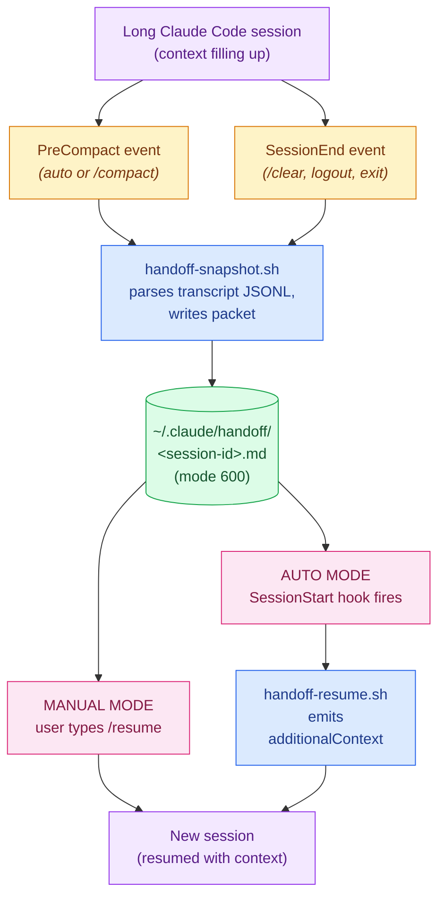

# claude-code-handoff

[](https://github.com/bansalbhunesh/claude-code-handoff/actions/workflows/ci.yml)
[](LICENSE)
[](https://github.com/bansalbhunesh/claude-code-handoff/releases)
[](tests/)

> **Claude Code forgets. This plugin remembers.**
>
> Long sessions hit context limits. Claude compacts. The summary it leaves behind keeps the shape but loses the texture — the dead ends, the decisions, the half-finished thought you cared about.
>
> `claude-code-handoff` writes a small structured note right before that happens, and lets the next session pick up from it. So the next time you say "where were we?" — the answer is right there.

---

## Before vs after

| Without this plugin | With this plugin |
|---|---|
| Long session → compaction → summary survives, **details die** | PreCompact hook writes a `handoff/<session>.md` snapshot first |
| New session: "I have no idea what we were doing" | New session: `/resume` (or auto) → "Resuming X. Done A, B. Last decision: Y." |
| `/clear` = total amnesia | SessionEnd hook captures even `/clear` exits |
| Lost context = re-explore + re-explain | Pick up where you left off, ~5 seconds |

No daemon. No code change. ~250 lines of bash + jq, one install, one uninstall. Plays nice with any other hooks you already have.

---

## Quick start

```bash
git clone https://github.com/bansalbhunesh/claude-code-handoff.git
cd claude-code-handoff
./install.sh
```

That's it. Compaction now leaves a packet behind. Resume with:

```
/resume
```

Want it fully automatic (no typing `/resume`)?

```bash
./install.sh --auto
```

A `SessionStart` hook will inject the packet on every post-compaction or resumed session. Opt-in because some of the underlying mechanism is undocumented — see [Limitations](#limitations).

---

## What a packet looks like

A real packet from a real session — markdown, human-readable, ~1–2 KB:

```markdown
# Handoff packet
- session: 300b907c-d452-4064-ac2c-ee2b9c98213f
- event: PreCompact
- generated: 2026-04-26T23:16:48Z
- cwd: /Users/ankur
- continues_from: 7c2db8e1-...   # only set if this is a chained session

## Original goal
build a /handoff slash command + PreCompact hook

## Current todos
(no TodoWrite calls in this session)

## Task tracker
#1. [completed] Write handoff-snapshot.sh
#2. [completed] Wire PreCompact hook
#3. [in_progress] Test the round-trip

## Recently edited files
- Write: ~/.claude/scripts/handoff-snapshot.sh
- Edit:  ~/.claude/settings.json
- Write: ~/.claude/commands/resume.md

## Recent assistant reasoning
The keystone is `PreCompact` → `SessionStart(source=compact)`. Snapshot at
PreCompact, re-inject at SessionStart. Verified with /compact in another
terminal — the hook fires and the packet lands.

---

Next: confirm /resume can read it from a fresh session before adding the
auto-resume `SessionStart` hook.
```

That's the whole format. Pure markdown. You can `cat`, `grep`, `vim`, or feed it to anything.

---

## Two ways to resume

| | **Manual** (default) | **Auto-resume** (`--auto`) |
|---|---|---|
| **How** | Type `/resume` in a new session | New session auto-loads packet |
| **Triggered by** | You | `SessionStart` hook (`compact` / `resume` matchers) |
| **Permission prompt on first use** | Pre-approved by `allowed-tools` frontmatter — none | None |
| **Stability** | Documented and stable | Relies on `SessionStart`'s `additionalContext` injection (works today, undocumented size limits) |
| **Best for** | First-time users, low-trust environments | Power users who've confirmed manual mode works |

Switching modes is one command, both directions:

```bash
./install.sh --auto    # turn on auto-resume
./install.sh           # turn off auto-resume (re-running without --auto strips it)
```

Third-party `SessionStart` hooks (from other plugins) are preserved across toggles.

---

## Daily use — `claude-handoff` CLI

`bin/claude-handoff` is installed to `~/.claude/bin/`. Add that to your `$PATH`, or invoke by full path.

```text
$ claude-handoff list
300b907c-d452-4064-ac2c-ee2b9c98213f        1h 30m ago

1 packet(s). Use 'claude-handoff view <session-id>' to read one.
```

```text
$ claude-handoff status
claude-code-handoff status
  version (cli):      0.2.0
  jq:                 1.6
  handoff dir:        present (mode 700)
  snapshot script:    installed
  resume script:      installed
  /resume command:    installed
  PreCompact hook:    wired
  SessionEnd hook:    wired
  SessionStart hook:  not wired (manual mode)
  mode:               manual
  packets stored:     1
```

| Subcommand | What it does |
|---|---|
| `claude-handoff list` | All packets, newest first, with relative ages |
| `claude-handoff view` | Show the most recent packet |
| `claude-handoff view <session-id>` | Show a specific packet |
| `claude-handoff search <pattern>` | Case-insensitive grep across all packets, with surrounding context |
| `claude-handoff chain [<session-id>]` | Walk `continues_from` links and print the full chain (default: latest) |
| `claude-handoff edit <session-id>` | Open a packet in `$EDITOR` to redact secrets without losing the rest |
| `claude-handoff status` | Install state, mode, jq version, packet count |
| `claude-handoff path` | Print the handoff directory path |
| `claude-handoff prune --older-than 30d` | Delete packets older than 30 days (interactive) |
| `claude-handoff prune --keep 20` | Keep 20 most recent, delete the rest (interactive) |
| `claude-handoff help` | Show usage |

**Environment knobs** for the snapshot script (set in your shell or hook env):

| Variable | Effect |
|---|---|
| `CLAUDE_HOME` | Override `~/.claude` (must match what `install.sh` was given) |
| `HANDOFF_KEEP_N=20` | After each snapshot, keep only the 20 newest packets — built-in retention without cron |
| `HANDOFF_DEBUG=1` | Append a one-line status to `~/.claude/handoff/.log` per hook fire (for troubleshooting silent hooks) |

`prune` is **always interactive** — it lists what it will delete and asks before removing anything.

---

## How it works

The plugin sits between Claude Code's lifecycle events and the filesystem. Two scripts, one packet directory, five hook entries:



Time-ordered version of the same story:

```mermaid
sequenceDiagram
    actor U as You
    participant S1 as Old session
    participant H as PreCompact hook
    participant FS as handoff/&lt;sid&gt;.md
    participant S2 as New session

    Note over S1: working on a long task
    S1->>S1: context fills up<br/>(or you type /compact)
    S1->>H: fires PreCompact event
    H->>FS: write structured packet
    Note over S1: Claude Code compacts<br/>(wipes message history)

    U->>S2: open new session

    rect rgba(252, 231, 243, 0.4)
    Note over U,S2: Manual mode (default)
    U->>S2: types /resume
    S2->>FS: reads latest packet
    S2-->>U: "Resuming work on X.<br/>Done: A, B. Last decision: ..."
    end

    rect rgba(220, 252, 231, 0.4)
    Note over U,S2: Auto mode (--auto)
    Note over S2: SessionStart hook<br/>(matcher: compact / resume)
    FS-->>S2: hook injects packet<br/>via additionalContext
    S2-->>U: replies already aware of prior context
    end
```

The five hook entries the installer wires up:

| Event | Matcher | Mode | Script | Fires when |
|---|---|---|---|---|
| `PreCompact` | `auto` | always | `handoff-snapshot.sh` | Just before context-limit-driven auto-compaction |
| `PreCompact` | `manual` | always | `handoff-snapshot.sh` | When you type `/compact` |
| `SessionEnd` | (any) | always | `handoff-snapshot.sh` | When a session terminates (`clear`, `logout`, `prompt_input_exit`) |
| `SessionStart` | `compact` | `--auto` only | `handoff-resume.sh` | When a fresh session begins after compaction |
| `SessionStart` | `resume` | `--auto` only | `handoff-resume.sh` | When a session is resumed (`claude --resume`) |

`handoff-snapshot.sh` reads the session transcript JSONL, parses out goal / todos / task tracker / edited files / recent reasoning, and writes a markdown packet. **Always exits 0** — never blocks the underlying event.

`handoff-resume.sh` finds the most relevant packet (matching `session_id` first, then most recently modified), caps it at 16,000 codepoints (UTF-8-safe), and emits the documented `hookSpecificOutput.additionalContext` JSON shape Claude Code uses to inject context.

---

## Platforms

| Platform | Status | Notes |
|---|---|---|
| **macOS** | Fully supported | Tested locally + CI on `macos-latest` |
| **Linux** | Fully supported | CI runs on `ubuntu-latest` every push |
| **Windows / Git Bash** | Should work | Claude Code uses Git Bash on Windows natively (since 2025); same shell, same scripts. **Caveat:** NTFS doesn't enforce POSIX file modes — `chmod 600` / `chmod 700` are advisory there |
| **Windows / WSL** | Works like Linux | Recommended over Git Bash for proper file-mode enforcement |
| **Windows / native PowerShell** | Not supported | Scripts are bash. A PowerShell port is on the roadmap if there's demand — open an issue |

CI matrix runs both `ubuntu-latest` and `macos-latest`; Windows is intentionally not in CI yet because the official runners require some Git-Bash-specific path handling that hasn't been validated.

---

## Requirements

- **Claude Code** (CLI) — any recent version with hooks support
- **`bash`** 3.2 or newer (macOS default works; Git Bash on Windows works)
- **`jq`** ≥ 1.6 (we use the `//=` operator)

| OS | Install jq |
|---|---|
| macOS | `brew install jq` |
| Debian / Ubuntu | `sudo apt-get install jq` |
| Fedora / RHEL | `sudo dnf install jq` |
| Windows (Git Bash) | scoop / choco / static binary |
| Windows (WSL) | use the Linux command for your distro |
| anywhere | static binary at <https://jqlang.github.io/jq/download/> |

The plugin makes no network calls. No dependencies beyond bash + jq + standard POSIX tools (`find`, `stat`, `mv`, `mktemp`, `date`).

---

## Security

Handoff packets capture **verbatim user prompts and assistant prose** — including anything you pasted into the conversation (API keys, `.env` content, passwords, tokens) and anything the assistant repeated back in its replies. Packets sit on disk under `~/.claude/handoff/` until you delete them.

**What the plugin does:**

- **Mode 700** on `~/.claude/handoff/` (owner-only access on Unix-y filesystems)
- **Mode 600** on every newly-written packet
- **Refuses to write** through a symlinked handoff directory or symlinked output path
- **Validates `session_id`** with a regex before using it as a filename, blocking path-traversal
- **Hooks always exit 0** — they never block compaction or session shutdown, but they also never break your terminal

**What you should do:**

- **Don't paste secrets into the conversation** if you're not comfortable with them ending up in `~/.claude/handoff/`. If you do, run `./uninstall.sh --purge` (or `claude-handoff prune --keep 0`) to delete saved packets.
- Treat `~/.claude/handoff/` as sensitive — back it up only to encrypted destinations, never commit it.
- The plugin does **no automatic rotation** — packets accumulate indefinitely. Sweep periodically: `claude-handoff prune --older-than 30d` or `find ~/.claude/handoff -mtime +30 -delete`.
- **On Windows / Git Bash specifically:** NTFS doesn't enforce POSIX modes. The `chmod` calls succeed but the actual access control comes from Windows ACLs (which inherit from your user dir, so packets are still owner-private in practice). If you want hard-enforced POSIX permissions on Windows, run inside WSL2.

---

## FAQ

**Does it slow down Claude Code?**
No. The hook is a single bash invocation that reads the transcript and writes one file — typically <100ms even for hour-long sessions. Always exits 0, so even if it crashes it doesn't block the event.

**Does it touch my code or send anything over the network?**
No code changes. No network calls. The packet is local-only, owner-readable.

**Will my packets pile up forever?**
Yes, until you prune. Run `claude-handoff prune --older-than 30d` periodically or set up a cron. There's a roadmap item to make rotation built-in.

**What if I have other tools that hook PreCompact / SessionEnd / SessionStart?**
They keep working. The installer does a `jq` merge, not a clobber. Third-party hooks on the same matcher are preserved alongside ours; uninstall strips only entries pointing at our scripts.

**Why is `Current todos` always empty?**
Modern Claude Code uses `TaskCreate` / `TaskUpdate` instead of `TodoWrite`. The plugin captures both — the actually-useful section is `Task tracker`. The `TodoWrite` field stays for back-compat.

**What's the difference between `/resume` and auto-resume?**
Both load the same packet. `/resume` is a slash command you type; auto-resume is a `SessionStart` hook that injects automatically. Auto-resume relies on undocumented behavior (size limits, presentation to the model), so it's opt-in. Manual is recommended until you've confirmed it works for your setup.

**Can I run this on a shared machine?**
Yes, but each user gets their own `~/.claude/handoff/`. If you share `$HOME` (rare), the mode-700 directory stops other users from reading packets, but anyone with the same UID could.

**What about Codex / Cursor / other AI coding tools?**
Right now this is Claude-Code-specific because it depends on Claude Code's hook events (`PreCompact`, `SessionEnd`, `SessionStart`). If similar tools expose comparable hooks, a port would be small. PRs welcome.

---

## Troubleshooting

### `/compact` runs but no packet appears

Run `claude-handoff status`. If `PreCompact hook` shows `NOT WIRED`, the install merge didn't take — re-run `./install.sh`.

If it shows `wired` but a packet still doesn't appear:
- Scripts always exit 0 (so nothing logs on failure). Temporarily add `set -x` near the top of `~/.claude/scripts/handoff-snapshot.sh` to see what's failing.
- Check `jq` is on your `PATH` — the hook runner inherits a minimal env on some platforms.

### `/resume` doesn't appear in the slash menu

Claude Code auto-discovers `~/.claude/commands/`. No restart needed. Check the file exists:

```bash
ls -la ~/.claude/commands/resume.md
```

If it does and `/resume` still isn't recognized, confirm the frontmatter is intact (the file must start with `---`).

### `/resume` works but says "no handoff file exists"

You haven't triggered `PreCompact` or `SessionEnd` yet — packets only appear on those events. Force one with `/compact` in any active session.

### Auto-resume installed but new sessions don't pick up prior context

Some `SessionStart` injection behavior is undocumented. If `claude-handoff status` shows `mode: auto` but resumed sessions don't reference the packet, fall back to manual:

```bash
./install.sh   # re-run without --auto
```

You can still type `/resume` to load context.

### `install.sh: jq >= 1.6 is required`

Update jq with the command for your OS in the [Requirements](#requirements) table.

### Windows: `chmod` warnings or odd permissions

NTFS doesn't enforce POSIX modes the way macOS/Linux do. The chmod calls succeed; the *effective* access control comes from Windows ACLs. For hard-enforced POSIX permissions, use WSL2 with a Linux filesystem.

---

## Limitations

- **`Current todos` is usually empty.** Modern Claude Code uses `TaskCreate` / `TaskUpdate`. The actually-useful section is `Task tracker`.
- **Auto-resume relies on undocumented behavior.** `SessionStart`'s `additionalContext` injection is documented; size limits, version-availability, and presentation to the model are not. Plugin caps injection at 16,000 codepoints defensively.
- **`SessionEnd` doesn't fire on hard kills.** Clean exits (`/clear`, logout, `prompt_input_exit`) trigger it; SIGKILL or harness crashes don't, and the packet for that session is lost.
- **Each packet describes one session.** Older packets remain on disk; chains link via `continues_from`, but `/resume` currently loads only one packet at a time.
- **Goal heuristic is best-effort.** Filters out compact summaries (`isCompactSummary` flag), command meta (`isMeta` flag, plus `<` / `⏺` prefix fallback), and empty messages. Slash-command-only sessions correctly report `(unknown)`.

---

## Uninstall

```bash
./uninstall.sh             # remove scripts + hooks, keep packets
./uninstall.sh --purge     # also delete ~/.claude/handoff/ entirely
```

Strips only entries pointing at our scripts (`handoff-snapshot.sh` and `handoff-resume.sh`); preserves any third-party hooks on the same matchers.

---

## Tested

62 integration tests across 5 suites:

| Suite | Tests | What it covers |
|---|---|---|
| `test_snapshot.sh` | 15 | Empty / binary / symlinked / malformed transcripts; mode bits; regex rejection; `CLAUDE_HOME` override; `HANDOFF_KEEP_N` prune; `HANDOFF_DEBUG` log |
| `test_resume.sh` | 11 | UTF-8 boundary truncation; symlink refusal; valid JSON shape; payload validation |
| `test_installers.sh` | 12 | Fresh install, mode toggling, third-party hook coexistence, malformed settings |
| `test_e2e.sh` | 1 | Full snapshot → resume round trip |
| `test_cli.sh` | 23 | Every CLI subcommand including search, chain, edit, prune confirm/abort flows |

Run them all:

```bash
bash tests/run-all.sh
```

Expected output ends with `62 tests, 62 pass, 0 fail`. CI runs the same suite on `macos-latest` and `ubuntu-latest` via [GitHub Actions](.github/workflows/ci.yml) on every push and PR.

---

## Roadmap

- **Cross-session chain walking.** `continues_from` is captured today but `/resume` loads one packet at a time. Make `/resume` walk the chain (limited depth) and merge packets, so a session compacted multiple times can recover early-session decisions.
- **Pre-compact size monitoring.** If a `context_used_pct` env var ever appears in the hook payload, fire snapshots earlier (e.g., 70% full) so packets don't always reflect the most-degraded state.
- **Built-in packet rotation.** Auto-prune older than N days, configurable at install time.
- **Empirical sizing for `additionalContext`.** Test what size injection actually makes it through and adjust the 16K-codepoint cap.
- **Native Windows / PowerShell port.** If there's demand. Open an issue if you'd use it.

---

## Project meta

- **[Changelog](CHANGELOG.md)** — versioned history (current: v0.3.0)
- **[Contributing](CONTRIBUTING.md)** — how to file issues, run tests, submit PRs
- **[Code of Conduct](CODE_OF_CONDUCT.md)** — Contributor Covenant 2.1

## Contributing

Issues and PRs welcome. **Read [CONTRIBUTING.md](CONTRIBUTING.md) first** — it covers the dev setup, test workflow, code style, and PR checklist.

Quick path:

```bash
git clone https://github.com/bansalbhunesh/claude-code-handoff.git
cd claude-code-handoff
bash tests/run-all.sh         # all 62 should pass
```

If you find a bug, the [issue templates](.github/ISSUE_TEMPLATE/) ask the right 30-second-form questions; please use them.

## Acknowledgments

- The [JuliusBrussee/caveman](https://github.com/JuliusBrussee/caveman) repo, both for the project's existence (proof Claude Code skills can be small and useful) and for showing what an OSS README that *enjoys itself* looks like.
- Anthropic's [Claude Code hooks documentation](https://code.claude.com/docs/en/hooks) — the lifecycle events this plugin builds on.

## License

MIT — see [LICENSE](LICENSE).

---

*Why use big context when small packet do trick.*
